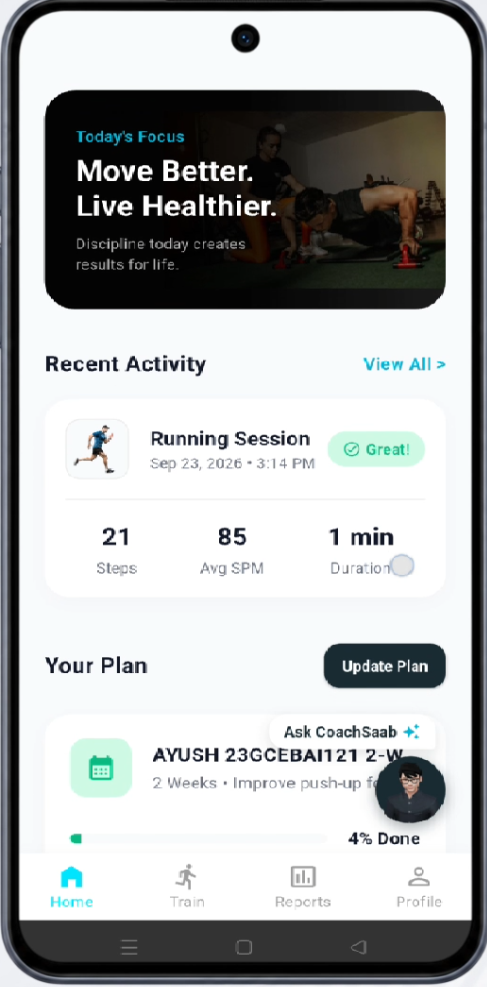
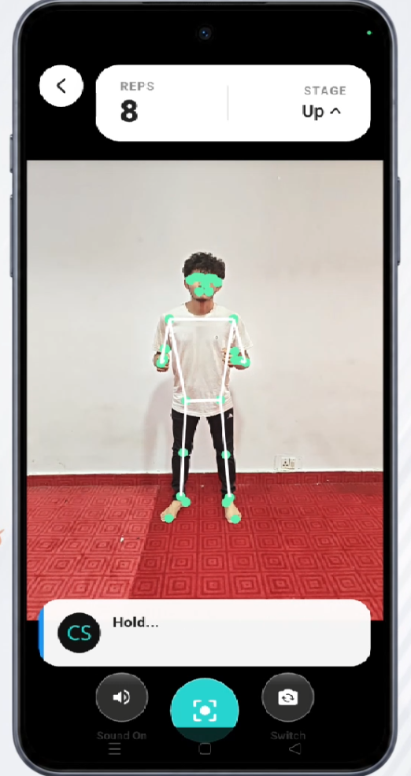
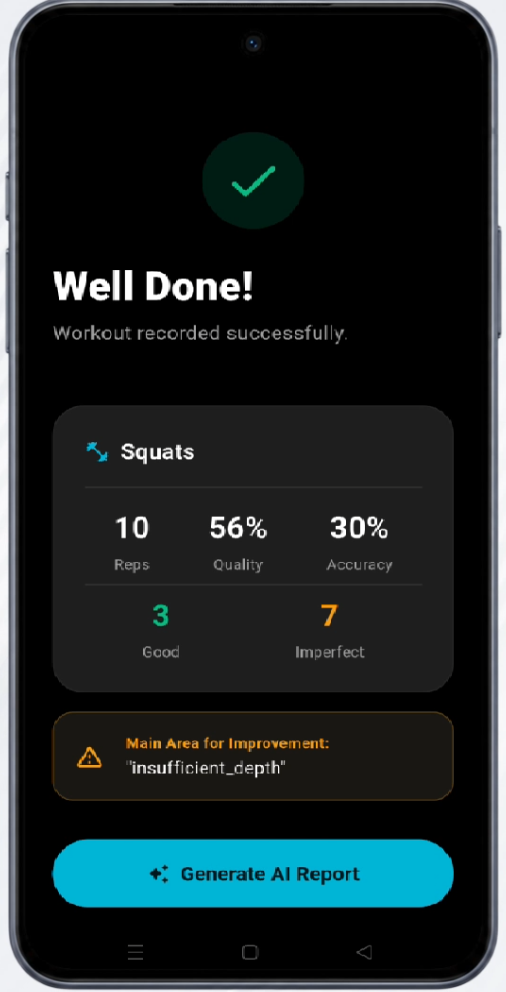
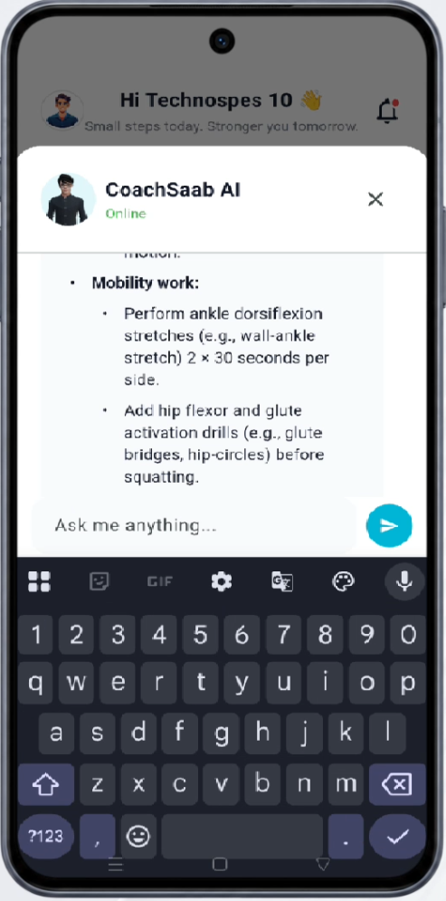

# 🏋️ CoachSaab

### **Vision-Based AI Fitness Coach with Real-Time Biomechanical Tracking & Adaptive Planning**

<div align="center">

[](https://sih.gov.in)
[](https://flutter.dev)
[](https://fastapi.tiangolo.com)
[](https://developers.google.com/mediapipe)
[](https://supabase.com)
[](LICENSE)

<p align="center">
  <b>Transforming ordinary smartphone cameras into an active, on-device biomechanical laboratory.</b><br>
  <i>No expensive wearable sensors. No cloud video latency. Zero video privacy risks.</i>
</p>
[🎥 Video Demo](#-demo-video) • [📌 Problem Statement](#-problem-statement) • [🏗️ Architecture](#️-system-architecture) • [⚡ Getting Started](#-getting-started) • [📡 API Specs](#-backend-api-highlights)

---

</div>

## 📖 Overview

**CoachSaab** is an intelligent, privacy-first fitness companion that turns any Android smartphone into a real-time personal trainer. By leveraging on-device pose estimation and an agentic AI backend, CoachSaab doesn't just count your reps — it **understands your movement**, corrects your form in real time, and continuously adapts your training plan based on historical performance.

Whether you're a beginner struggling with squat depth or an athlete chasing progressive overload, CoachSaab delivers instant, actionable, and personalized coaching without ever compromising your privacy.

---
## 📱 Application Interface & Workflow

<div align="center">

| 1. Home & Routine | 2. Live Form Tracking | 3. Post-Workout Summary | 4. AI Coach Reasoning |
| :---: | :---: | :---: | :---: |
|  |  |  |  |
| *Adaptive plan & daily targets* | *33-point CV pose estimation & voice cues* | *Rep breakdown & dominant deviation* | *LangGraph agent reasoning over logs* |

<br/>

[](docs/Coachsaab_Demo.mp4)
&nbsp;
[](https://github.com/technospes/CoachSaab-backend/raw/main/docs/Coachsaab_Demo.mp4)

</div>

---

## 📌 Problem Statement

Physical inactivity and incorrect exercise posture are major contributors to repetitive strain injuries and abandoned workout routines. Current digital fitness applications suffer from three critical bottlenecks:

| # | Challenge | Impact |
|---|-----------|--------|
| 1 | **Lack of Real-Time Supervision** | Static video guides and workout logs cannot verify posture or correct kinematic deviations while exercising. |
| 2 | **Bandwidth & Privacy Inefficiencies** | Streaming live camera feeds to cloud servers creates latency bottlenecks, requires high-bandwidth connections, and introduces severe privacy risks. |
| 3 | **Disconnected Feedback Loops** | Workout metrics are rarely synthesized into adaptive, context-aware training regimens, leading to plateaus and generic advice fatigue. |

> **CoachSaab solves this by closing the loop:** Edge-based pose estimation detects movement phases and delivers instant audio cues, while an agentic AI reasons over historical session data to adapt future training plans.

---

## 🚀 Key Features

<table>
<tr>
<td width="50%">

### ⚡ Real-Time On-Device Pose Tracking
33-point skeletal landmark evaluation running **locally** via Google MediaPipe. Instant vector calculation determines joint angles, rep inflection points, and exercise depth at **30–60 FPS**.

### 🗣️ Sub-Second Voice Cues
Native Text-to-Speech (TTS) engine provides immediate corrective feedback:
- *"Keep chest upright"*
- *"Hit proper depth"*
- *"Halfway there"*

### 📊 Granular Session Diagnostics
Form Quality Scores, Good vs. Imperfect repetition counts, cadence (SPM), and automatic **Dominant Deviation** detection.

</td>
<td width="50%">

### 🧠 Context-Aware AI Coach
A **LangGraph/LLM-powered** conversational agent capable of reasoning over past workout telemetry to personalize routines and answer progress queries.

### 📈 Neumorphic Progress Dashboard
Visualizes consistency, exercise-specific performance trends, and movement issues over custom timeframes.

### 🔒 Privacy-by-Design
Camera frames are analyzed entirely in **volatile device memory** and discarded immediately. **No video ever leaves the device.**

</td>
</tr>
</table>

---

## 🏗️ System Architecture

```text
┌────────────────────────────────────────────────────────────────────────┐
│                        CLIENT LAYER (Flutter)                          │
│                                                                        │
│   [ Camera Feed ] ──► [ MediaPipe 33 Landmarks ] ──► [ Angle Math ]    │
│                                                             │          │
│   [ Audio Cues (TTS) ] ◄── [ Finite State Machine ] ◄───────┘          │
│                                     │                                  │
│                                     ▼                                  │
│                          [ Session Telemetry JSON ]                    │
└─────────────────────────────────────┬──────────────────────────────────┘
                                      │  HTTPS / JWT
                                      ▼
┌────────────────────────────────────────────────────────────────────────┐
│                      BACKEND LAYER (FastAPI)                           │
│                                                                        │
│   [ REST API Gateway ] ──► [ Session Manager ] ──► [ Diagnostic Engine]│
│                                                             │          │
│   [ LangGraph Reasoning Agent ] ◄── [ RAG Context Builder ] │          │
│               │                                             ▼          │
│               └──────────────────────────────► [ Analytics & Trends ]  │
└─────────────────────────────────────┬──────────────────────────────────┘
                                      │  Async SQL
                                      ▼
┌────────────────────────────────────────────────────────────────────────┐
│                      DATA LAYER (Supabase)                             │
│                                                                        │
│   • user_profiles       • workout_sessions       • rep_results         │
│   • activity_configs    • activity_rules         • chat_history        │
└────────────────────────────────────────────────────────────────────────┘
```

### 🔄 Data Flow

1. **Capture** → Frontend captures live camera feed on the device.
2. **Analyze** → MediaPipe extracts 33 skeletal landmarks per frame.
3. **Evaluate** → Custom vector math engine computes joint angles and classifies rep phase.
4. **React** → Finite State Machine triggers TTS corrections in real time.
5. **Sync** → Compact session telemetry (JSON, no video) is sent to the backend.
6. **Reason** → LangGraph agent synthesizes insights and personalizes future plans.

---

## 📂 Project Structure

This monorepo is organized into two independent sub-projects:

```text
CoachSaab/
├── .gitignore                      # Unified master gitignore
├── README.md                       # Repository documentation
│
├── frontend/                       # Flutter Mobile Client
│   ├── android/                    # Android native configuration
│   ├── assets/                     # Custom icons and illustrations
│   ├── lib/
│   │   ├── main.dart               # Entry point & app theme
│   │   ├── screens/                # UI screens (Home, Reports, Summary, Train)
│   │   ├── tracking/               # MediaPipe wrappers & pose math engine
│   │   └── widgets/                # Reusable Neumorphic UI components
│   └── pubspec.yaml                # Flutter dependencies
│
└── backend/                        # FastAPI Application Server
    ├── app/
    │   ├── api/                    # Route handlers & endpoints (v1)
    │   ├── core/                   # Security, JWT, database connections
    │   ├── models/                 # SQLAlchemy ORM models
    │   ├── schemas/                # Pydantic validation schemas
    │   └── services/               # AI reasoning, prompt templates, analytics
    ├── requirements.txt            # Python dependencies
    └── main.py                     # ASGI application bootstrap
```

---

## 🛠️ Tech Stack

| Layer | Technologies |
|-------|--------------|
| **Mobile Client** | Flutter, Dart, Neumorphic UI Design |
| **Computer Vision** | Google MediaPipe Pose Landmarker, CameraX, Vector Mathematics |
| **Audio / Feedback** | Native Android Text-to-Speech (TTS) |
| **Backend API** | FastAPI, Python 3.10+, Pydantic v2, Uvicorn |
| **AI & Orchestration** | LangGraph, LangChain, Qwen / LLM Inference |
| **Database & Auth** | Supabase (PostgreSQL), SQLAlchemy (Async), Alembic |
| **Deployment** | Render Cloud, Android Release APK |

---

## ⚡ Getting Started

### Prerequisites

Before you begin, ensure you have the following installed:

- ✅ **Flutter SDK** `≥ 3.19.0` — [Install Guide](https://docs.flutter.dev/get-started/install)
- ✅ **Python** `≥ 3.10` — [Download](https://www.python.org/downloads/)
- ✅ **PostgreSQL / Supabase** account with API credentials — [Supabase](https://supabase.com)
- ✅ **Android Studio** or **VS Code** with Flutter plugin
- ✅ Physical Android device (recommended for camera testing)

---

### 1️⃣ Backend Setup

```bash
# Navigate to backend directory
cd backend

# Create and activate virtual environment
python -m venv venv

# Windows:
.\venv\Scripts\activate
# macOS/Linux:
source venv/bin/activate

# Install dependencies
pip install -r requirements.txt

# Configure Environment Variables
cp .env.example .env
# Edit .env with your SUPABASE_URL, SUPABASE_KEY, and JWT_SECRET

# Run the development server
uvicorn main:app --reload --port 8000
```

> 📘 Interactive API documentation will be available at **[http://localhost:8000/docs](http://localhost:8000/docs)**

#### 🔑 Required Environment Variables

```env
SUPABASE_URL=your_supabase_project_url
SUPABASE_KEY=your_supabase_anon_key
JWT_SECRET=your_jwt_secret_key
LLM_API_KEY=your_llm_provider_key
```

---

### 2️⃣ Frontend Setup

```bash
# Navigate to frontend directory
cd frontend

# Install Flutter dependencies
flutter pub get

# Ensure connected device or emulator is running
flutter devices

# Run on Android device
flutter run
```

> 💡 **Tip:** For best performance, use a physical Android device with a minimum of 4GB RAM.

---

## 📡 Backend API Highlights

| Method | Endpoint | Description |
|:------:|----------|-------------|
| `POST` | `/api/v1/sessions` | Logs completed workout metrics, rep breakdown, and dominant deviations |
| `GET` | `/api/v1/users/{id}/sessions` | Retrieves historical session logs (supports pagination) |
| `GET` | `/api/v1/users/{id}/dashboard` | Returns calculated KPIs, trend arrays, and common issues |
| `GET` | `/api/v1/activity-configs` | Returns dynamically supported exercises and tracking rules |
| `POST` | `/api/v1/coach/chat` | Dispatches user questions to the LangGraph AI coach with session context |

---

## 🔐 Privacy & Security

CoachSaab is built with a **privacy-first architecture**:

- 🎥 **No video transmission** — All pose analysis happens on-device
- 🧠 **No frames stored** — Camera buffers are discarded immediately after inference
- 🔐 **JWT-secured APIs** — All backend communication is authenticated and encrypted
- 🗄️ **Encrypted at rest** — Session data stored in Supabase with row-level security

---

## 🗺️ Roadmap

- [x] Real-time pose estimation with MediaPipe
- [x] Voice-cue feedback engine
- [x] Session diagnostics & dominant deviation detection
- [x] LangGraph-powered conversational coach
- [x] Neumorphic progress dashboard
- [ ] 🚧 iOS support
- [ ] 🚧 Additional exercise library (deadlifts, pull-ups, yoga poses)
- [ ] 🚧 Wearable heart-rate integration
- [ ] 🚧 Social challenges & leaderboards

---

## 👥 Team Cat_GPT

**Smart India Hackathon 2026** — *Student Innovation / Fitness Technology Category*

| Role | Contributor |
|------|-------------|
| 🎯 Team Lead & System Architect | **Ayush Shukla** |

---

## 🤝 Contributing

Contributions, issues, and feature requests are welcome! Feel free to check the [issues page](../../issues).

1. Fork the repository
2. Create a feature branch (`git checkout -b feature/amazing-feature`)
3. Commit your changes (`git commit -m 'feat: add amazing feature'`)
4. Push to the branch (`git push origin feature/amazing-feature`)
5. Open a Pull Request

---

## 📄 License

This project is licensed under the **MIT License** — see the [LICENSE](LICENSE) file for details.

---

<div align="center">

### ⭐ If you find CoachSaab useful, please give it a star!

**Built with 💪 for Smart India Hackathon 2026**

[⬆ Back to Top](#️-coachsaab)

</div>
